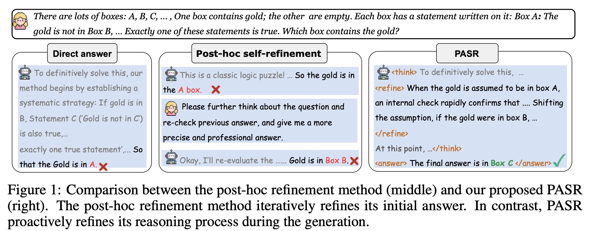

<!-- # A Stitch in Time Saves Nine: Proactive In-Process Self-Refinement for Language Models
[[📄 Paper (PDF)]](./figs/PASR_0925.pdf)  -->
<h1 align="center">A Stitch in Time Saves Nine: Proactive In-Process Self-Refinement for Language Models</h1>

<div align="center"> 

[](./figs/PASR_0925.pdf)
[]() 

</div>
- We propose PASR, a method that enables proactive self-refinement throughout the generation process via reinforcement learning.
- We design a comparison-based reward strategy to assess the effectiveness of proactive self-refinement and guide model behavior during training.
- We empirically demonstrate the effectiveness and efficiency of PASR across a diverse set of tasks. In particular, on Qwen3-8B, PASR significantly reduces average token consumption by 41.6\% compared to the standard generation method, while also achieving a 8.2\% improvement in accuracy.

<div align=center>
    
</div>

## Install Dependencies

```
conda create -n PASR python=3.10.9
conda activate PASR
conda install pytorch==2.5.1 torchvision==0.20.1 torchaudio==2.5.1 pytorch-cuda=12.4 -c pytorch -c nvidia
pip install -r requirements.txt
```
## Quick Start

```
cd PASR

# Start the evaluation model to evaluate the quality of the rollout samples
bash vllm_empoy.sh

# Start the GRPO refinement server model
CUDA_VISIBLE_DEVICES=1 python ref_server.py

# Start the PASR-GRPO training with DeepSpeed
CUDA_VISIBLE_DEVICES=2,3 deepspeed pasr_main.py
```

You can configure the training parameters in ``PASR/config.py``. 

| Parameter     | Description                                                                                                                                                              |
| ------------- | ------------------------------------------------------------------------------------------------------------------------------------------------------------------------ |
| `model_path`  | Path to the base language model (e.g., `"Qwen2.5-7B/"`). This is the model you fine-tune or refine during training.                                                      |
| `data_path`   | Path to the training dataset.  
| `gen_device`   | GPU ID used specifically for generation (e.g., 5), often different from training GPU.   |
| `Q_batch_size` | Number of generations per batch during rollout.                                         |
| `num_pre_Q`    | Group size for candidate generations (e.g., 8), used in candidate filtering or scoring. |     
| `eval_prompt` | Prompt template used for evaluation. It contains a question, ground truth answer, and AI-generated answer, and asks for binary scoring (1 for correct, 0 for incorrect). |
| `train_batch_size`  | Batch size for training steps (e.g., 2).                                                                                  |
| `all_steps`         | Total number of training steps (e.g., 3000).                                                                              |
| `ref_server` | URL of the reference model server used for evaluation or scoring. |
| `port`       | Port number for the local reference server (default is 59809).    |
| `wandb_key`     | Your wandb API key for authentication (keep this private). |


Notes:
- Ensure gen_device does not conflict with the GPU used for training if running both simultaneously.
- Use wandb to monitor training progress and generation quality in real time.

## Evaluation
```bash
# inference
cd eval
CUDA_VISIBLE_DEVICES=1 python inference.py --model_name your_ckp --data_names you_can_choice_multipe_dataset --output_path ./eval_results

# get the acc 
python eval_with_vllm

# calculate the final average score
python get_scores.py
```
We use the following generation configuration during evaluation:
``` python
sampling_params_stop = SamplingParams(
    n=1,
    temperature=0,
    max_tokens=1500
)
```


# Data
We also provide the training data and test data in the `/data` fold.